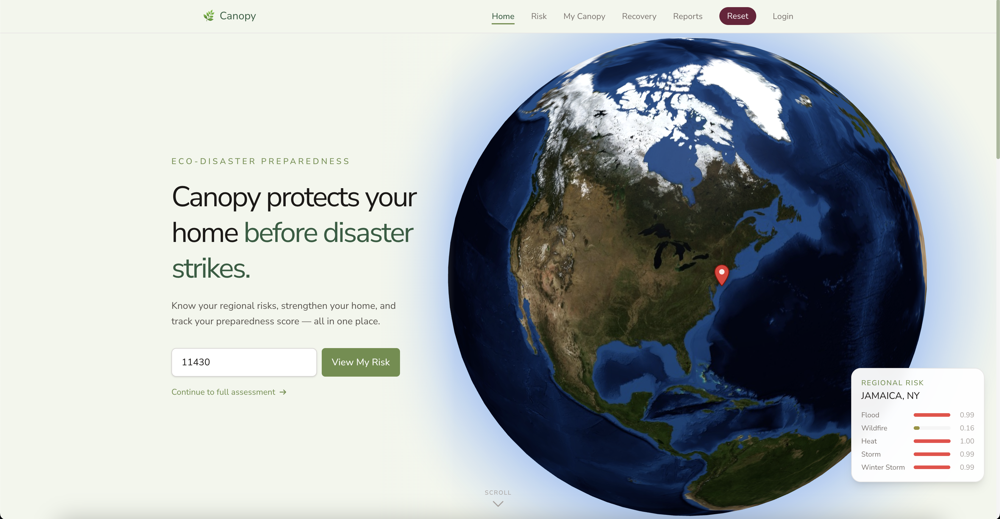
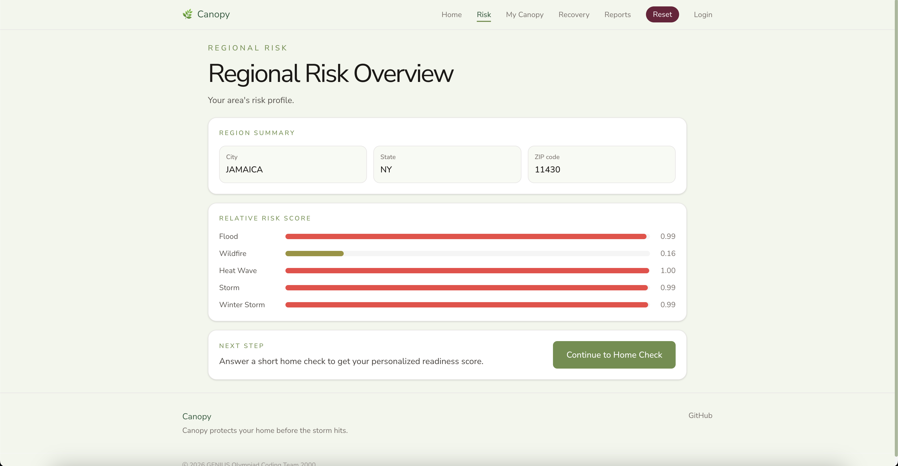
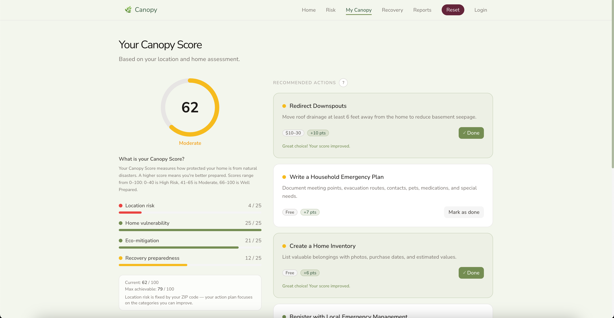
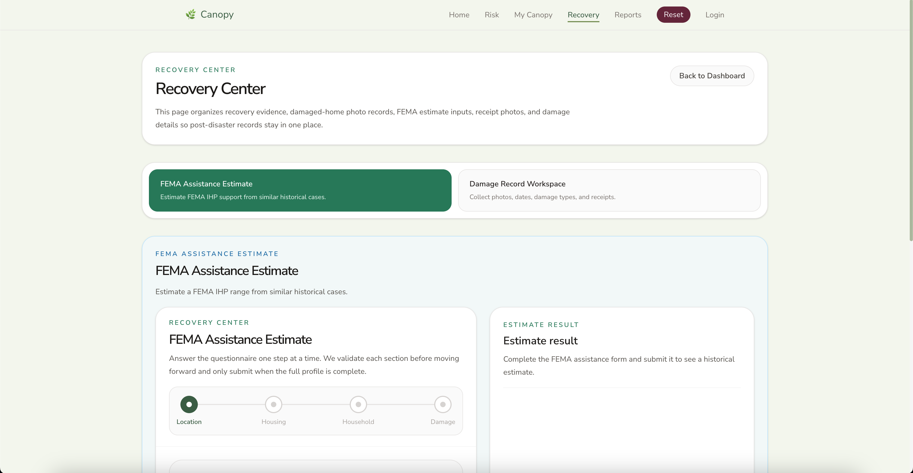
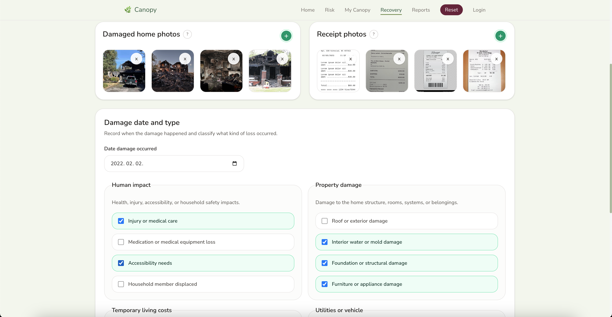
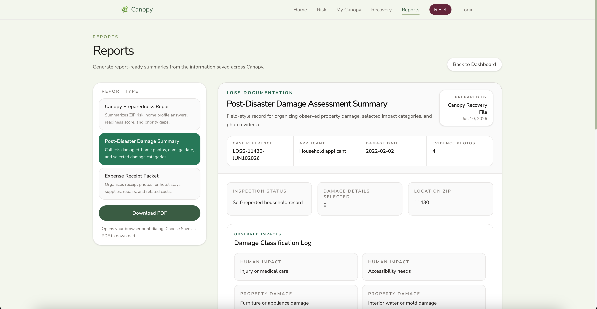
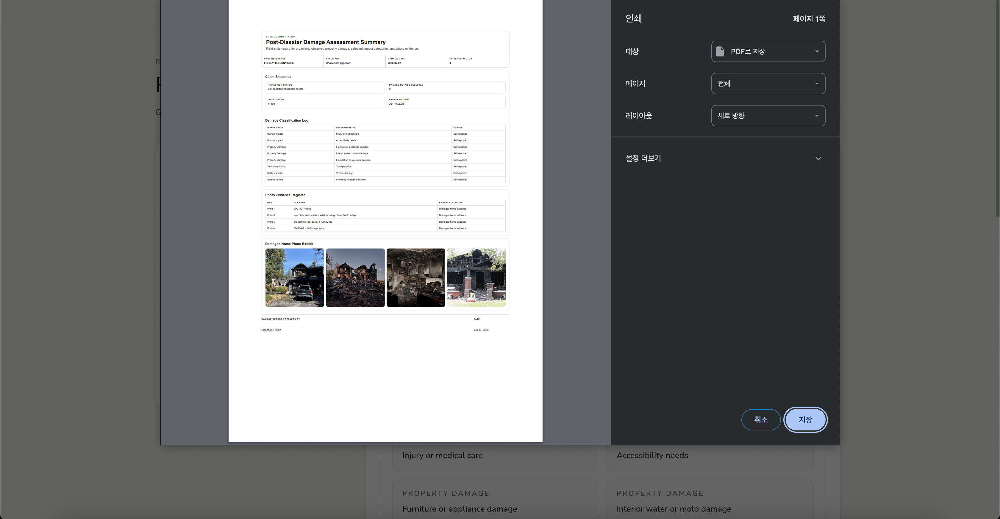

# Canopy

Canopy is a React + Vite web app that helps households understand local disaster risk, prepare a home readiness profile, and organize post-disaster recovery documentation.

## Overview

Canopy is a disaster preparedness and recovery support prototype built for location-aware household resilience planning. The app separates pre-disaster readiness work from post-disaster recovery workflows:

- Users enter a ZIP code to look up regional disaster risk.
- Users complete a home readiness questionnaire before a disaster.
- Canopy calculates a preparedness score and recommends eco-resilience actions.
- After disaster damage, users can use the Recovery Center to estimate historical FEMA IHP assistance, collect damaged-home photos, track receipt photos, and record damage details.
- Users can generate report-ready preparedness, damage, and receipt summaries from saved profile and recovery information.

The current codebase stores most prototype profile data in browser `localStorage`, scoped by a lightweight local account system. Supabase is used for risk lookup tables and FEMA assistance summary queries when environment variables are configured.

## Motivation

Disaster recovery often forces households to navigate fragmented information, repeated forms, stressful evidence collection, and slow assistance decisions while they are already under pressure. Canopy addresses that gap by helping users prepare important household information before a disaster and organize relevant recovery documentation after damage occurs.

The project connects environmental disaster preparedness with recovery support by combining public disaster-risk data, home vulnerability questions, eco-mitigation recommendations, and recovery document workflows in one accessible frontend.

## Features

- **ZIP-based regional risk lookup**: Looks up county-level risk profiles for flood, wildfire, heat, storm, and winter storm categories using a ZIP-to-county crosswalk.
- **Regional risk overview**: Displays location summary and relative risk bars after a ZIP code is selected.
- **Home readiness questionnaire**: Collects pre-disaster home, document, insurance, mitigation, and preparedness information.
- **Canopy preparedness score**: Calculates a 0-100 readiness score with category breakdowns for location risk, home vulnerability, eco-mitigation, and recovery preparedness.
- **Eco-resilience recommendations**: Suggests mitigation actions from the local `ecoSolutions` dataset and simulates score impact as actions are marked complete.
- **Local account prototype**: Supports browser-local account creation, sign-in, sign-out, and profile scoping.
- **Reports page**: Generates printable report previews for preparedness, post-disaster damage summaries, and expense receipt packets.
- **Recovery Center**: Provides a post-disaster workspace for FEMA assistance estimate inputs, damaged-home photos, receipt photos, damage date, and damage type selections.
- **FEMA historical assistance estimate**: Queries Supabase-backed `fema_ihp_assistance_summary` records to return historical estimate ranges where matching data exists.
- **Responsive frontend UI**: Uses React components and Tailwind CSS utilities for a mobile-friendly app layout.

## Screenshots / Demo

<p align="center">
  
</p>

<p align="center">
  
</p>

<p align="center">
  
</p>

<p align="center">
  
</p>

<p align="center">
  
</p>

<p align="center">
  
</p>

<p align="center">
  
</p>

## Tech Stack

- React 19
- Vite 8
- JavaScript / JSX
- Tailwind CSS 4 with `@tailwindcss/vite`
- React Router
- Supabase JavaScript client
- Recharts
- `react-globe.gl`
- Vercel-compatible Vite deployment
- FEMA National Risk Index-style county risk data
- HUD-USPS ZIP Code Crosswalk data
- FEMA Individuals and Households Program summary data, when loaded into Supabase

## Project Structure

```txt
.
├── data/
│   ├── raw/                 # Source dataset files used by data-prep scripts
│   └── processed/           # Transformed CSVs for ZIP and county risk tables
├── public/                  # Static app assets such as logo and icons
├── scripts/                 # Python data preparation scripts
├── src/
│   ├── components/          # Shared UI, layout, risk, score, recommendation, and recovery components
│   ├── context/             # React context for local auth state
│   ├── data/                # Local app datasets and questionnaire metadata
│   ├── lib/                 # Supabase client setup
│   ├── pages/               # Route-level React pages
│   ├── services/            # Data lookup, local auth, profile sync, and FEMA estimate services
│   └── utils/               # Scoring, recommendations, risk display, and recovery helpers
├── supabase/migrations/     # Supabase SQL migration files
├── AGENT_GUIDE.md           # Contributor and agent architecture guidance
├── package.json             # App dependencies and npm scripts
└── vite.config.js           # Vite, React, and Tailwind plugin configuration
```

## Installation

1. Clone the repository:

```bash
git clone <repository-url>
cd genius-coding-2000
```

2. Install dependencies:

```bash
npm install
```

3. Configure environment variables if using Supabase-backed risk lookup and FEMA assistance estimates. Create a `.env.local` file manually using the variables below.

4. Start the development server:

```bash
npm run dev
```

5. Build for production:

```bash
npm run build
```

6. Preview the production build locally:

```bash
npm run preview
```

## Environment Variables

The app reads these Vite environment variables in `src/lib/supabaseClient.js`:

```env
VITE_SUPABASE_URL=
VITE_SUPABASE_ANON_KEY=
```

Without these variables, the Supabase client is not initialized. The FEMA assistance estimate service returns a no-match state when Supabase is unavailable. ZIP-based regional risk lookup expects Supabase tables to be configured.

## Usage

After starting the app, use the main flow:

1. Open the landing page and continue to location setup.
2. Enter a 5-digit ZIP code or choose one of the sample ZIPs shown in the UI.
3. Review the regional risk overview for flood, wildfire, heat, storm, and winter storm risk.
4. Complete the home questionnaire to create a pre-disaster home profile.
5. View the Canopy Score dashboard, category scores, weaknesses, and recommended mitigation actions.
6. Open Reports to view and print preparedness, damage, or receipt summaries.
7. Open the Recovery Center after disaster damage to record damage details, upload photo evidence, upload receipt photos, and run the FEMA historical assistance estimate form.

Current routes are defined in `src/App.jsx`:

- `/` - landing page
- `/login` - browser-local account login/create account
- `/location` - ZIP input and saved location profile
- `/risk` - regional risk overview
- `/questionnaire` - home readiness questionnaire
- `/dashboard` - Canopy Score dashboard
- `/recovery` - post-disaster Recovery Center
- `/reports` - printable report previews
- `/user-info` - redirects to `/reports`

## Data Sources

This project uses publicly available FEMA-related and government datasets for educational and prototype purposes. It is not affiliated with, endorsed by, or guaranteed by FEMA or any government agency.

- **FEMA National Risk Index v1.20, December 2025**: Used by `scripts/prepare_nri_county_risk_profiles.py` to transform county-level hazard risk scores into app risk categories.
- **HUD-USPS ZIP Code Crosswalk, 2025Q4**: Used by `scripts/prepare_zip_county_crosswalk.py` to map ZIP codes to county FIPS records.
- **Processed local CSVs**:
  - `data/processed/county_risk_profiles.csv`
  - `data/processed/zip_county_crosswalk.csv`
- **Raw local data files**:
  - `data/raw/NRI_Table_Counties.csv`
  - `data/raw/ZIP_COUNTY.xlsx`
- **FEMA IHP assistance summary data**: Queried through the Supabase table `fema_ihp_assistance_summary` by `src/services/femaAssistanceEstimateService.js` when available.

## Testing / Verification

No formal test suite is currently defined in `package.json`. The main verification commands are:

```bash
npm run build
npm run lint
```

`npm run build` is the primary production-readiness check for the current app.

## Code Style

- Component-based React structure with route-level pages under `src/pages`.
- Tailwind utility classes and design tokens in `src/index.css`.
- Service files under `src/services` for data lookup, local auth, profile persistence, and FEMA estimate access.
- Utility files under `src/utils` for scoring, recommendations, risk display, and recovery helper logic.
- Local app data and questionnaire metadata are kept under `src/data`.

## Deployment

This is a Vite app and can be deployed to Vercel or any static hosting platform that supports Vite builds.

For Vercel:

1. Import the repository into Vercel.
2. Set the build command to `npm run build`.
3. Set the output directory to `dist`.
4. Add `VITE_SUPABASE_URL` and `VITE_SUPABASE_ANON_KEY` in the Vercel project environment variables if Supabase-backed features are required.

## Contributing

- Read `AGENT_GUIDE.md` before changing app architecture.
- Keep pre-disaster profile logic separate from post-disaster recovery workflow logic.
- Do not treat `Recovery.jsx` as the primary saved profile page.
- Do not put post-disaster damage questions into the pre-disaster home profile flow.
- Reuse existing service and utility functions instead of duplicating scoring, recommendation, matching, or persistence logic inside components.
- Preserve localStorage backward compatibility when changing profile or recovery data models.
- Run `npm run build` before submitting changes.

## Credits

- Built with React, Vite, Tailwind CSS, React Router, Supabase, Recharts, and `react-globe.gl`.
- Uses FEMA National Risk Index-style risk data for prototype disaster risk planning.
- Uses HUD-USPS ZIP Code Crosswalk data for ZIP-to-county matching.
- Uses FEMA Individuals and Households Program-related summary data for historical estimate prototyping when available.

No individual contributor names are listed in the current project documentation.

## License

License information has not been specified yet.
